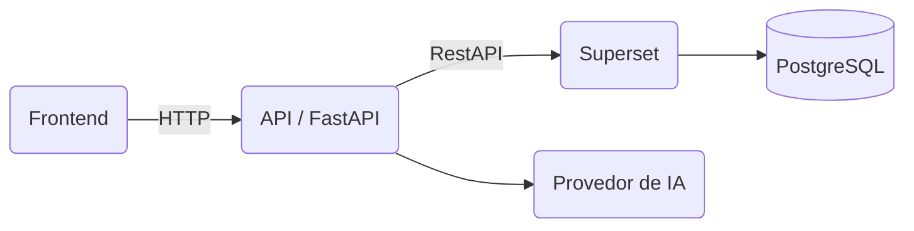

## 📊 DataSUS - Plataforma de Inteligencia em Saúde

Plataforma de analytics e self-service BI voltada para o setor de saúde pública. O projeto centraliza datasets de diferentes fontes, disponibiliza uma camada semântica para métricas e dimensões e permite a criação de consultas, análises, visualizações e dashboards interativos.

A arquitetura combina FastAPI, PostgreSQL, DuckDB, Parquet e Next.js, com uma camada analítica baseada em Apache Superset. A plataforma também prevê recursos de inteligência artificial capazes de interpretar solicitações em linguagem natural e transformá-las em consultas, análises e estruturas de dashboards.

## 1. Estrutura do projeto

