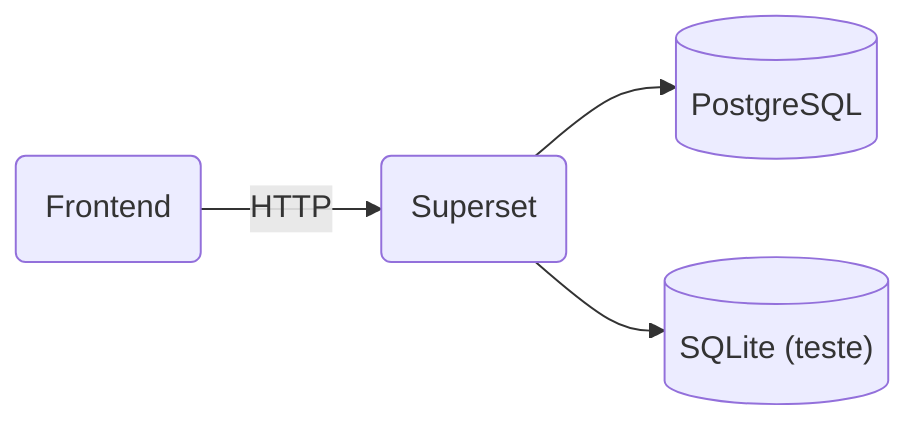

# Monisus

Plataforma de analytics e self-service BI baseada em Apache Superset para analise de dados em saude publica.

## Arquitetura



## Pré-requisitos

- Docker
- Docker Compose

## Setup

1. Clone o repositorio:

```bash
git clone https://github.com/Lucasbig6/monisus.git
cd monisus
```

2. Crie o arquivo `.env` na raiz do projeto (ou ajuste o existente):

```env
SUPERSET_SECRET_KEY=sua_chave_secreta_aqui
POSTGRES_USER=superset
POSTGRES_PASSWORD=superset_password
POSTGRES_DB=superset
```

3. Suba os containers:

```bash
docker compose up -d --build
```

4. Inicialize o banco de dados e crie o usuario admin:

```bash
docker exec superset_app superset db upgrade
docker exec superset_app superset fab create-admin \
  --username admin \
  --firstname Admin \
  --lastname User \
  --email admin@monisus.com \
  --password admin
docker exec superset_app superset init
```

5. Acesse o Superset:

```
http://localhost:8088
```

**Login:** `admin` / `Senha:** `admin`

## Banco de dados de teste

O projeto inclui um banco SQLite (`test.db`) com uma tabela `vendas` contendo 20 registros de dados ficticios.

Para conectar no Superset:

1. Va em **Data > Databases**
2. Adicione uma nova conexao com URI:

```
sqlite:////app/superset_home/test.db
```

### Consultas SQL de exemplo

```sql
-- Total de vendas por regiao
SELECT regiao, COUNT(*) as total_vendas, SUM(valor) as valor_total
FROM vendas
GROUP BY regiao
ORDER BY valor_total DESC;

-- Vendas por categoria
SELECT categoria,
       COUNT(*) as qtd_registros,
       SUM(valor * quantidade) as faturamento,
       ROUND(AVG(valor), 2) as preco_medio
FROM vendas
GROUP BY categoria
ORDER BY faturamento DESC;

-- Vendas por mes
SELECT substr(data, 1, 7) as mes,
       COUNT(*) as qtd_vendas,
       SUM(valor * quantidade) as faturamento
FROM vendas
GROUP BY mes
ORDER BY mes;
```

## Upload de CSV

1. Va em **Data > Databases** e ative **"Allow CSV Upload"** na conexao
2. Va em **Data > Upload CSV**
3. Selecione o arquivo, o banco e a tabela de destino

## Estrutura

```
monisus/
├── docker-compose.yml    # Orquestracao dos containers
├── Dockerfile            # Build customizado do Superset
├── superset_config.py    # Configuracoes do Superset
├── test.db               # Banco SQLite de teste
├── uploads/              # Pasta para uploads de CSV
├── .env                  # Variaveis de ambiente (nao committar)
├── .gitignore
└── README.md
```

## API

O Superset fornece REST API documentada em Swagger:

```
http://localhost:8088/swagger/v1
```

Para autenticar:

```bash
# Obter token
curl -X POST http://localhost:8088/api/v1/security/login \
  -H "Content-Type: application/json" \
  -d '{"username":"admin","password":"admin","provider":"db","refresh":true}'

# Usar o access_token retornado
curl http://localhost:8088/api/v1/dashboard/ \
  -H "Authorization: Bearer <access_token>"
```

## Comandos uteis

```bash
# Subir containers
docker compose up -d --build

# Parar containers
docker compose down

# Ver logs
docker logs superset_app

# Acessar shell do container
docker exec -it superset_app bash

# Sincronizar permissoes
docker exec superset_app superset init
```

## Licenca

Apache License 2.0
